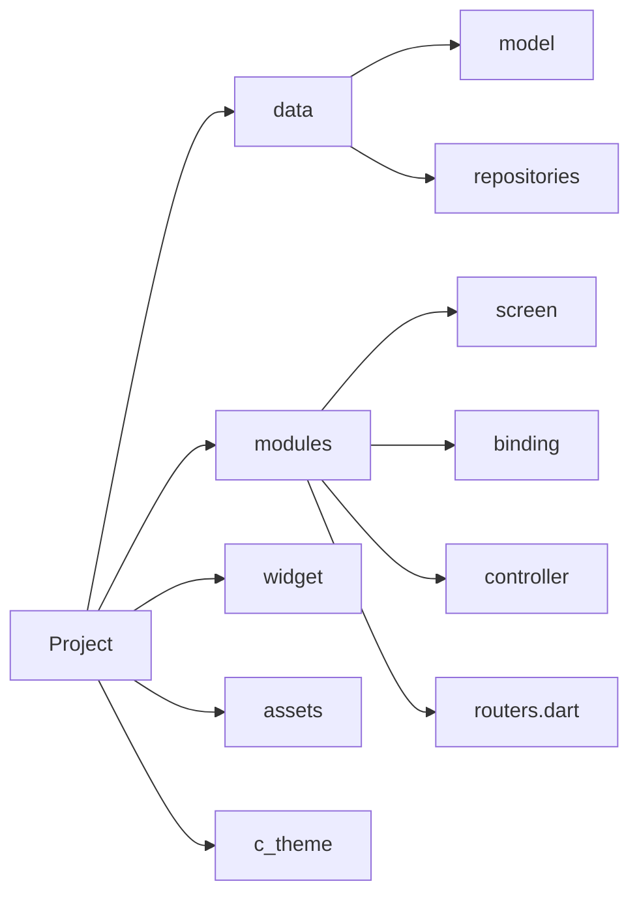

# Calories!
Ứng dụng quản lý ...

> phát triển bởi:
>  - Vương Quang Huy
>  - Nguyễn Công Chính
>  - Nguyễn Huy Hùng

# Quy tắc github

1. **Phát triển tính năng:**
   Luôn tạo nhánh mới dừ develop, trước khi commit phải merge từ develop về để tránh khi merge tính năng vào dev bị confilic
2. **Quy tắc đặt tên nhánh:**
   feature/ < tên tính năng >
   e.g: feature/fix_ui_bottomsheet
3. **Yêu cầu comment giải thích code hàm sử lý để người sau có thể hiểu**

## Quy tắc project

1.  Tên file, thư mục không được viết hoa
    eg: detail_plant_screen.dart
2.  Tên class viết hoa chữ cái đầu sau mỗi phân cách
    eg: DetailPlantScreen
3. Tổ chức thư mục:
   **data**:  chứa thư mục con là **models** và **repositories**
   *model*: chứa các đối tượng
   *repositories*: quản lý tất cả các hàm gọi api trả về
   **modules**: chứa 1 modul bao gồm 3 file *screen* , *binding*, *controller*,  và file *routers.dart* quản lý tuyến đường
   **widget**: chứa các widget con được viết thành hàm. mục đích để tái sử dụng ở các screen khác
   **assets**: quản lý ảnh, video, ... được import vào
   **c_theme**: quản lý custom theme
   sơ đồ:

